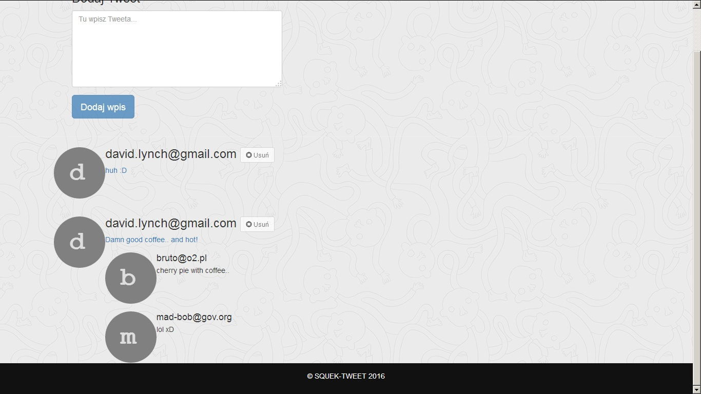

# TWEET
## Mock Twitter - my first application in OOP PHP & MySQL

### Features:

- registration
- login and logout using session
- edit profile
- delete account
- CRUD actions (add, edit, delete tweets and comments)
- Responsive Web Design using HTML/CSS/Bootstrap
- in front-end javascript/jQuery

